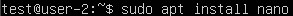
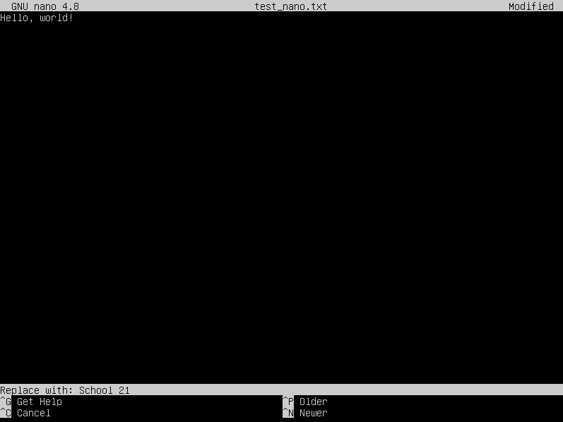
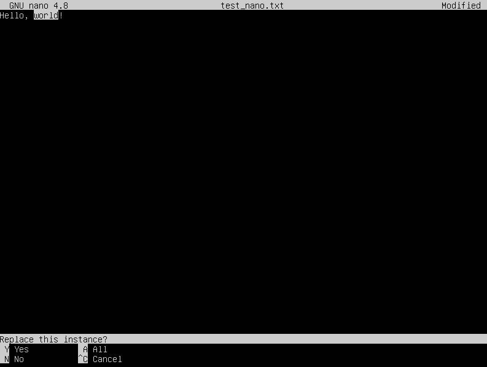

## Part 1. Установка ОС 
Устанавливаем `Ubuntu 20.04 Server LTS` без графического интерфейса. 
 

## Part 2. Создание пользователя 
* Вызов команды для создания нового пользователя `newUser`. 
  

* Проверка создания нового пользователя. 
  

* Список групп нового пользователя. 
  

## Part 3. Настройка сети ОС 

* Задаем название машины `user-1`. 
  

* Устанавливаем временную зону `Asia/Baku`. 
  

* Проверка сделанных изменений после перезагрузки сервера. 
  

* Вывод в консоль названия сетевых интерфейсов, предварительно установив `net-tools`. 
  

>`lo (loopback device)` – виртуальный интерфейс, присутствующий `по умолчанию` в любом Linux. Он используется для отладки сетевых программ и запуска серверных приложений на локальной машине. С этим интерфейсом всегда связан адрес 127.0.0.1. У него есть dns-имя – localhost.

* Получение ip-адреса устройства от `DHCP-сервера`. 
  

>`DHCP (Dynamic Host Configuration Protocol)` - это протокол управления сетью, используемый в сетях TCP/IP, в котором DHCP-сервер динамически присваивает каждому устройству IP-адрес и другие параметры сетевой конфигурации, чтобы они могли связываться с другими IP-сетями.

* Определение внутренного ip-адреса шлюза. 
   

* Определение внешнего ip-адреса шлюза с помощью утилиты `curl`. 
   

* Задаем статичные (заданные вручную, а не полученные от DHCP сервера) настройки ip, gw, dns, используя публичный DNS серверы (1.1.1.1 или 8.8.8.8). Для этого изменяем файл `etc/netplan/*.yaml`. 
  Было: 
   
  Стало: 
   
  Применяем изменения. 
   

* Перезагружаем виртуальную машину и проверяем статичные сетевые настройки (ip, gw, dns). Для этого пропинговываем удаленные хосты 1.1.1.1 и ya.ru. 
   
   

## Part 4. Обновление ОС  

Обновим системные пакеты до последней версии. 
 

## Part 5. Использование команды *sudo*  

>`sudo (substitute user and do, подменить пользователя и выполнить)` позволяет выполнять программы от имени любого пользователя, но, если идентификатор или имя этого пользователя не указаны, то предполагается выполнение от имени суперпользователя ***root***. Таким образом, использование **sudo** позволяет выполнять привилегированные команды обычным пользователям без необходимости ввода пароля суперпользователя ***root***.

* Поменяем hostname ОС от имени пользователя `newUser`. 
   
* Проверим сделанные изменения. 
   

## Part 6. Установка и настройка службы времени  

* Настроим службу автоматической синхронизации времени. Для этого установим службу `timesyncd`. 
   
* Запустим сервис `ntp`. 
   
* Выведем время. 
   

## Part 7. Установка и использование текстовых редакторов  

### VIM

* Установим тектовый редактор `VIM`. 
   
* Создадим файл `test_vim.txt` и внесем туда изменения. Для внесения изменений необходимо перейти в режим редактирования (`INSERT`), для этого необходимо нажать `I`. После внесения изменений переходим в обычный режим с помощью клавиши `Esc`. Чтобы выйти и сохранить изменения, переходим в командный режим с помощью `:` и после этого вводим `wq`. 
   
* Откроем файл для редактирования (режим `INSERT`) и выйдем без сохранения (`Esc`, затем `:q!`). 
   
* Откроем файл для редактирования еще раз и внесем изменения (режим `INSERT`), после этого перейдем в обычный режим с помощью `Esc`. Выполним поиск и замену. Для этого перейдем в командный режим и выполним команду `:s/world/School 21`, при этом первый аргумент - это слово, которое мы ищем, а второй аргумент - на что меняем.
   
* Результат выполнения. 
   
* Сохраняем результат `:wq`.  

### NANO
* Установим текстовый редактор `NANO`. 
   
* Создадим файл `test_nano.txt` и внесем туда изменения. Чтобы выйти и сохранить изменения, нажимаем `Ctrl+X`, в открывшемся диалоговом окне `Save modified buffer?`, отвечаем `Y`. После этого можно изменить название файла. Чтобы оставить прежнее название, просто нажимаем `Enter`. 
   
* Откроем файл для редактирования и выйдем без сохранения: нажимаем `Ctrl+X`, в открывшемся диалоговом окне `Save modified buffer?`, отвечаем `N`. 
   
* Откроем файл для редактирования еще раз и внесем изменения. Выполним поиск и замену. Для этого необходимо нажать `Ctrl+\` и ввести слово для поиска. Подтверждаем ввод нажатием клавиши `Enter`. 
   
* Вводим слово, на которое мы хотим заменить, и подтверждаем ввод нажатием клавиши `Enter`. 
   
* В открывшемся диалоговом окне `Replace this instance?` для выполнения автоматической замены всех вхождений введенной строки нажимаем `A`. 
   
* Результат выполнения. 
   
* Сохраняем результат `Ctrl+X`, отвечаем `Y`.

### JOE
* Установим текстовый редактор `JOE`. 
   
* Создадим файл `test_joe.txt` и внесем туда изменения. Чтобы выйти и сохранить изменения, нажимаем `Ctrl+K`, после этого `X`, чтобы сохранить. 
   
* Откроем файл для редактирования и выйдем без сохранения: нажимаем `Ctrl+C`, после этого `Y`. 
   
* Откроем файл для редактирования еще раз и внесем изменения. Выполним поиск и замену. Для этого необходимо нажать `Ctrl+K` и после этого `F`. Вводим слово для поиска и подтверждаем ввод с помощью клавиши `Enter`.  
   
* Для замены в открывшемся диалоговом окне нажимаем `R` и подтверждаем ввод с помощью клавиши `Enter`. 
   
* Вводим слово или выражения, на которое мы хотим заменить, и подтверждаем ввод с помощью клавиши `Enter`. 
   
* В открывшемся диалоговом окне подтверждаем замену нажатием `Y`. 
   
* Результат выполнения. 
   
* Сохраняем результат `Ctrl+K`, после этого `X`. 

## Part 8. Установка и базовая настройка сервиса *SSHD*  

* Установим сетевой протокол `SSH`. 
   
* Установим `OpenSSH`. 
   
* Проверим работу `SSH`. 
   
* Перенастроим службу SSHd на порт 2022, для этого внесем изменения в файл `/etc/ssh/sshd_config`. 
   
* Перезагрузим `sshd.service`. 
   
* Покажем наличие пороцесса `sshd` с помощью команды `ps`, где флаг -А показывает все процессы, а с помощью команды grep мы ищем конкретный процесс по его имени. 
   
* Перезагружаем систему. 
   
* Выведем на экран состояние TCP-соединений с помощью утилиты `netstat`. 
   
  * `-t` - показывает активные TCP-соединения. 
  * `-a` - получение списка всех сокетов, использующих TCP-соединение. 
  * `-n` - отображает имя хоста, порт или пользователя в числовом формате. 
  * `Proto` - имя протокола (TCP или UDP). 
  * `Recv-Q` - количество полученных пакетов в очереди. 
  * `Send-Q` - количество отправленных пакетов в очереди. 
  * `Local Address` - IP-адрес локального компьютера и номер используемого порта. 
  * `Foreign Address` - IP-адрес и номер порта удаленного компьютера, подключенного к данному сокету. 
  * `State` - указание состояния подключения TCP. 
  * `0.0.0.0` - IP-адрес на локальной машине. 

## Part 9. Установка и использование утилит *top*, *htop*  

* Вывод команды `top`. 
   
  * `uptime` - время непрерывной работы 6 min. 
  * `количество авторизованных пользователей` - 1 user. 
  * `load average` - общая загрузка системы 0.00, 0.10, 0.07. 
  * `Tasks(total)` - общее количество процессов 121. 
  * `%Cpu(s)` - загрузка CPU:
    - 0.0 `us` - процент использования центрального процессора пользовательскими процессами. 
    - 0.1 `sy` - процент использования центрального процессора системными процессами. 
    - 0.0 `ni` - процент использования центрального процессора процессами с приоритетом, повышенным при помощи вызова. 
    - 99.9 `id` - процент времени, когда центральный процессор не используется. 
    - 0.0 `wa` - процент использования центрального процессора процессами, ожидающими завершения операций ввода-вывода. 
    - 0.0 `hi` - процент использования центрального процессора обработчиками аппаратных прерываний. 
    - 0.0 `si` - процент использования центрального процессора обработчиками программных прерываний. 
    - 0.0 `st` - количество ресурсов центрального процессора "заимствованных" у виртуальной машины гипервизором для других задач (таких, как запуск другой виртуальной машины). 
  * `загрузка памяти`:
    - `MiB Mem` - информация об использовании физической оперативной памяти:
      - 3931.3 `total` - общее количество памяти. 
      - 3347.9 `free` - количество свободной памяти. 
      - 177.0 `used` - количество используемой памяти. 
      - 406.4 `buff/cache` - количество памяти в кэше буферов. 
    - `MiB Swap` - информация об использовании раздела подкачки:
      - 2349.0 `total`. 
      - 2349.0 `free`. 
      - 0.0 `used`. 
      - 3532.4 `avail Mem` - это оценка физической памяти, доступной для запуска новых приложений без подкачки. 
  * `pid процесса`, занимающий больше всего памяти - 1. 
  * `pid процесса`, занимающий больше всего процессорного времени - 1. 
* Вывод команды `htop`, отсортированный по `PID`. 
   
* Вывод команды `htop`, отсортированный по `PERCENT_CPU`. 
   
* Вывод команды `htop`, отсортированный по `PERCENT_MEM`. 
   
* Вывод команды `htop`, отсортированный по `TIME`. 
   
* Вывод команды `htop`, отфильтрованный для процесса `sshd`. 
   
* Вывод команды `htop` с процессом `syslog`, найденным, используя поиск. 
   
* Добавление вывода `hostname`, `clock` и `uptime`. 
   

## Part 10. Использование утилиты *fdisk*  

* Вывод команды `sudo fdisk -l`. 
   
  * `название жесткого диска` - VBOX HARDDISK. 
  * `размер жесткого диска` - 25 ГБ. 
  * `количество секторов` - 52428800. 

## Part 11. Использование утилиты *df*  

* Вывод команды `df`. 
   
  * размер корневого раздела - 11758760 КБ. 
  * размер занятого пространства - 5569116 КБ. 
  * размер свободного пространства - 5570536 КБ. 
  * процент использования - 50%. 
* Вывод команды `df -Th`. 
   
  * размер корневого раздела - 12 ГБ. 
  * размер занятого пространства - 5.4 ГБ. 
  * размер свободного пространства - 5.4 ГБ. 
  * процент использования - 50%. 
  * тип файловой системы корневого раздела - ext4. 

## Part 12. Использование утилиты *du*  

* Вывод команды `du`. 
   
* Размер папок `/home`, `/var`, `/var/log` (в байтах, в человекочитаемом виде). 
   
* Размер всего содержимого в `/var/log`. 
   

## Part 13. Установка и использование утилиты *ncdu*  

* Установим утилиту `ncdu`. 
   
* Размер папки `/home`. 
   
* Размер папки `/var`. 
   
* Размер папки `/var/log`. 
   

## Part 14. Работа с системными журналами  

* Системный журнал `/var/log/dmesg`. 
   
* Системный журнал `/var/log/syslog`. 
   
* Системный журнал `/var/log/auth.log`. 
   
  * время последней успешной авторизации - 10:47:05. 
  * имя пользователя - test. 
  * метод входа в систему - по логину/паролю. 
*  Перезапустим службу `SSHd`. 
   
* Проверка записи в системном журнале `/var/log/auth.log`. 
   

## Part 15. Использование планировщика заданий *CRON*  

* Добавим задание с помощью планировщика заданий. 
   
* Вносим изменения в файл. 
   
* Проверим системный журнал `/var/log/auth.log` на наличие записей. 
   
* Вывод текущих задачи пользователя. 
   
* Удалим все задания из планировщика заданий. 
   
* Вывод текущих задач пользователя после удаления. 
   

